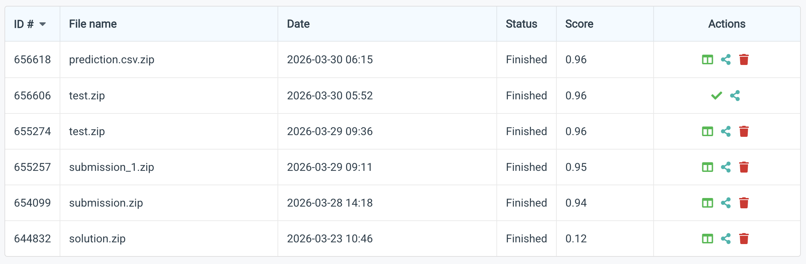
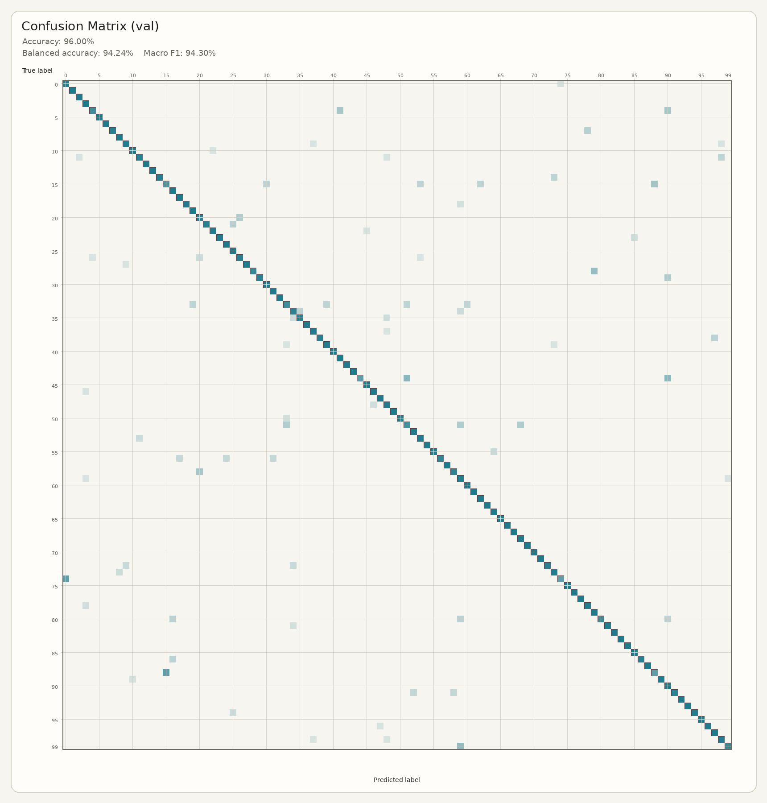
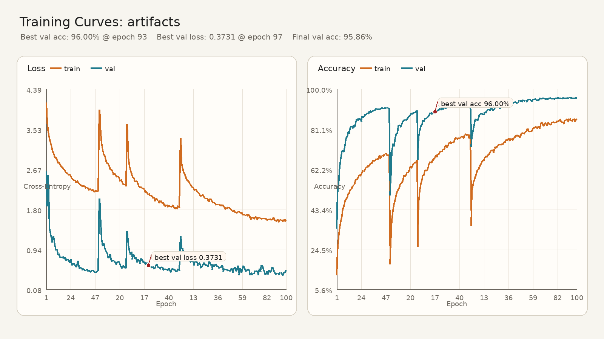

# HW1 Image Classifier

Name: Imrose Batterywala

Student ID: 314540010

This homework focused on using ResNet as a backbone for an image classification task. The dataset was that of 100 classes.

## Setup

```bash
python3 -m pip install -r requirements.txt
```

## Train

```bash
python3 train.py --data-dir data --output-dir artifacts --epochs 100 --batch-size 8
```

## Predict

```bash
python3 predict.py --checkpoint artifacts/best_model.pt --test-dir data/test --output artifacts/predictions.csv
```

## Leaderboard

### Snapshot (1)



### Snapshot (2)


## Artifacts

### Confusion Matrix



### Training Curve


